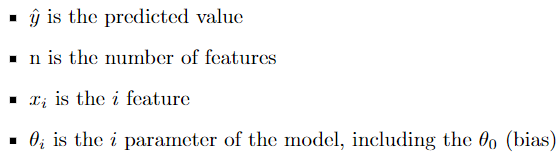
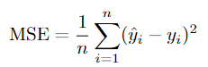
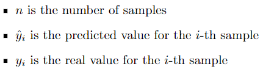

# A Non-Traditional Linear Regression

This repository demonstrates how to implement linear regression using Particle Swarm Optimization.

A linear regression model has the following form:

  

In this equation:

  

Once the model is constructed, we need to measure its performance. For this purpose, we use the Mean Square Error (MSE).

MSE is defined as follows:

  

In this equation:

  

Finally, to implement linear regression using Particle Swarm Optimization, we aim to find the minimum of the MSE function to perform the regression. We consider each particle as a vector of weights for our model.
